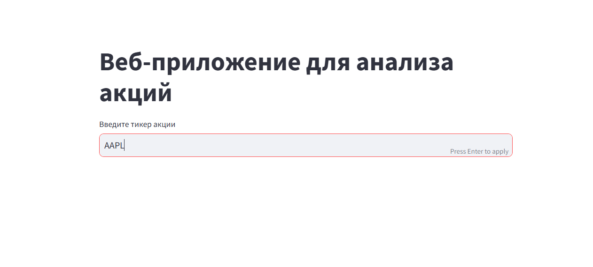
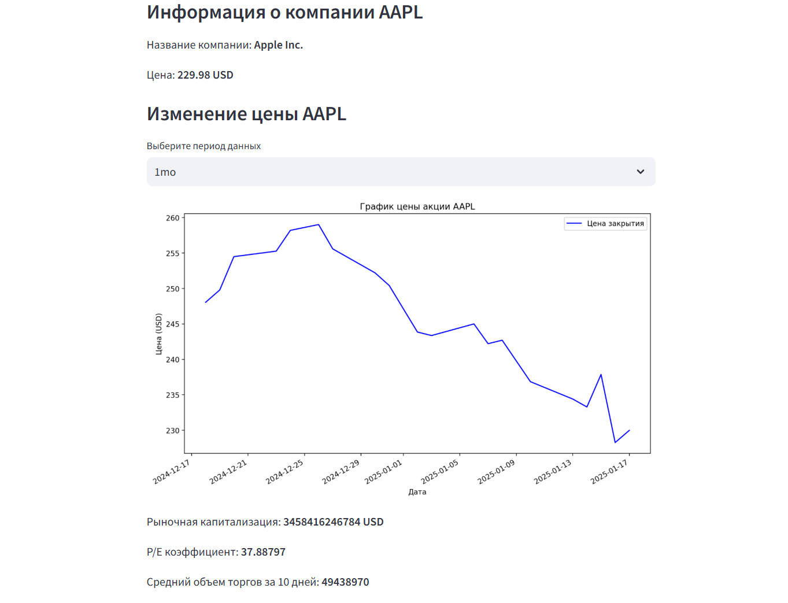
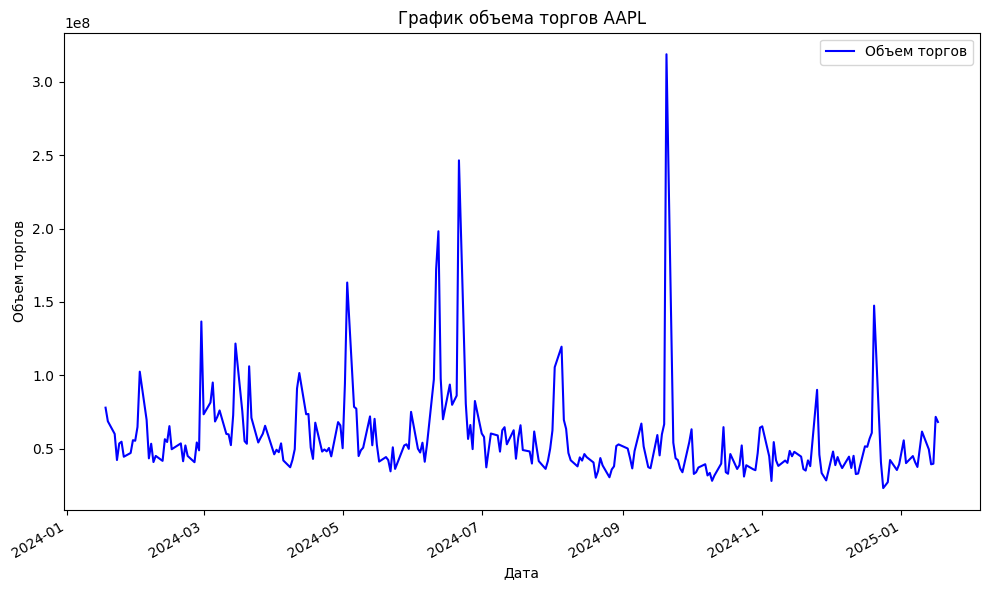

# Проект StockDataAnalysis

## Веб-приложение: "Анализ рынка акций"

Проект позволяет получить данные по акциям и провести их анализ. В дальнейшем эту информацию можно использовать для построения моделей прогнозирования. Проект работает с открытыымыи данными, полученными через библиотеку Yahoo Finance. 

## Автор

Главный и единственный автор - Елена Зудина

## Основные фукнции

В проекте реализованы следующие функции:

1. Поиск акции введенному пользователем тикеру
2. Получение базовой информации по акции
3. Визуализация данных с помощью графиков
4. Выбор периода отображения данных

## Структура

* main.py: Главный файл для запуска
* requriments.txt: Зависимости проекта
* stock_analysis: Jupyter Notebook  с анализом

## Инструкции по запуску

* Python версия 3.7 и выше
* Для работы с проектом необходим установить следующие библиотеки и фреймворки:
+ yfinance==0.2.51
+ streamlit==1.41.1
+ pandas==2.2.3
+ numpy==2.2.0
+ matplotlib==3.10.0
+ nbimporter==0.3.4

### Установка

1. Скачайте проект

`git clone https://github.com/ElenaZudina/StockDataAnalysis.git`

2. Перейдите в папку проекта

`cd StockDataAnalysis`

3. Установите зависимости 

`pip install -r requirements.txt`

### Запуск

Чтобы запустить проект введите в консоли команду:

`streamlit run main.py`

## Примеры использования

1. Начало работы веб-приложения

2. Ввод тикера для выбора акции

3. Результат работы веб-приложения

4. Примеры кода:

`ˇˇdef get_company_name(ticker):
    stock = yf.Ticker(ticker)
    company_name = stock.info.get('longName')
    return company_name`ˇˇ

 `def get_history_data(ticker, period):
    stock = yf.Ticker(ticker)
    data = stock.history(period=period)
    return data`

5. Пример визуализации данных    
 

## Техничекие требования

## Лицензия

MIT License

## Контакты

**E-mail:** elena.zudina@ivkhk.ee

